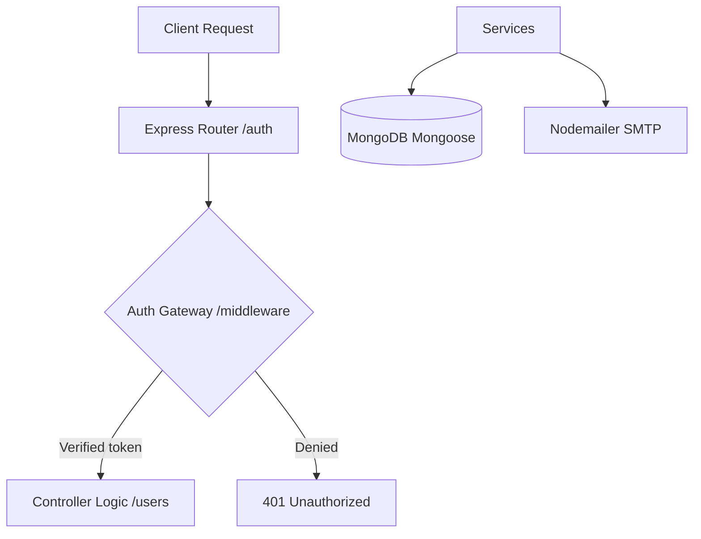

# FarmConnect Backend (Farmer-to-Consumer Marketplace API)

A direct marketplace backend connecting farmers to local buyers using Node.js, Express, TypeScript, and MongoDB.

## Overview

FarmConnect is a backend system designed to reduce dependency on middlemen in agricultural trade by connecting small-scale farmers directly with consumers.

In many local markets:
* **Farmers** often sell produce at unfairly low prices due to intermediaries
* **Consumers** pay more for fresh food without transparency
* **Supply chains** lack direct digital connection

This system solves that by enabling a direct farmer-to-buyer marketplace platform.

---

## Key Features

### Authentication & Security
* User registration with role-based checks (Farmer / Buyer roles)
* Secure login system with JWT authentication
* Password hashing using `bcryptjs`
* Password reset via time-limited tokens
* Protected routes using authentication middleware
* Email verification gate preventing unverified logins

### User Management
* Role-based accounts:
  * **Farmers** (custom produce categorization and farm listing details)
  * **Buyers** (direct farm-fresh food browsing)
* Profile handling & updates
* Secure account deletion
* Password change functionality

### Marketplace Core
* Farmers can create accounts and manage listings
* Buyers can securely access marketplace features
* Role-based access control across endpoints

### Password Recovery System
* Forgot password endpoint
* Secure reset token generation
* Expiring reset links via email
* Password reset via secure form submission

### Account Controls
* Logout functionality (token-protected)
* Password change with old password verification
* Secure account deletion endpoint

---

## Tech Stack

### Backend
* **Runtime**: Node.js
* **Framework**: Express.js
* **Language**: TypeScript

### Database
* **Database**: MongoDB
* **Object Modeling**: Mongoose

### Authentication & Delivery
* **Authentication**: JSON Web Token (JWT)
* **Encryption**: `bcryptjs`
* **Email Service**: `nodemailer` (SMTP)

---

## System Architecture



---

## API Endpoints

### Authentication Routes (`/auth`)

| Endpoint | Method | Description |
| :--- | :--- | :--- |
| `/auth/register-buyer` | `POST` | Create a new buyer account and send a welcome activation email |
| `/auth/register-farmer` | `POST` | Create a new farmer account and send a welcome activation email |
| `/auth/verify/:token` | `GET` | Verify account and complete registration activation |
| `/auth/login` | `POST` | Authenticate user and return secure JWT session |
| `/auth/logout` | `POST` | Logout user (protected route) |
| `/auth/change_password` | `POST` | Update password (protected route) |
| `/auth/forgot_password` | `POST` | Generate password reset token and send recovery link |
| `/auth/reset_password` | `POST` | Reset password using cryptographic token |
| `/auth/delete` | `POST` | Permanently delete account (protected route) |

---

## Project Structure

```
├── models/             # Mongoose schemas for data models (User, Product, Order, etc.)
├── users/              # Authentication and account controller routes (auth.ts)
├── middleware/         # Custom Express authentication gateway middleware
├── services/           # Nodemailer integration and template layout services
├── package.json        # Project script definitions and package list
├── tsconfig.json       # TypeScript compiler custom settings
└── server.ts           # System entry point and database connection config
```

---

## Project Goal

FarmConnect was built to demonstrate a real-world backend system that:
* Connects farmers directly to consumers
* Removes unnecessary middlemen in agricultural trade
* Improves fairness in pricing and accessibility
* Provides a scalable backend architecture using modern tools

---

## What This Project Demonstrates

* **RESTful API Design**: Following industry HTTP routing standards, robust error codes, and semantic paths.
* **Secure Auth Flow**: Seamless integration of JWT authorization guards and cryptographic hashing.
* **Role-Based Architecture**: Separation of concerns tailored uniquely for diverse business users (Farmers vs Buyers).
* **Clean Modular Code**: Organized directory structures designed to scale for high-traffic environments.
* **Real-World Problem Solving**: Direct structural resolution to age-old marketplace transparency and supply chain challenges using backend engineering.
